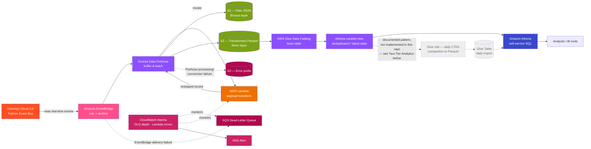

# Genesys EventBridge Streaming Lakehouse

Event-driven AWS data platform that replaces brittle API polling of Genesys Cloud CX event data with native EventBridge streaming — reducing reported data availability from **24+ hours to 2–10 minutes** and turning Data Engineering from a team of report-builders into a self-service data enablement layer.

[](#tech-stack)
[](#repository-layout)
[](LICENSE)

**Portfolio case study:** [Real-Time Contact Center Event Platform — one-page PDF](docs/case-study/EventBridge_Streaming_Platform_Case_Study.pdf)

> **A note on the numbers in this README.** This repo is a sanitized, from-scratch reconstruction of a production platform's *pattern* — not a copy of proprietary source or an independently reproducible benchmark. The 24+ hour to 2–10 minute latency range is a practitioner-reported production observation from the original implementation. The ~$35K storage figure is a projection, and field-presence figures in [`docs/data-dictionary.md`](docs/data-dictionary.md) are illustrative. Counts of what is actually in this repository — CloudFormation stacks, CloudWatch alarms, and dashboard widgets — are exact and directly verifiable against the code.

## Table of Contents

- [Overview](#overview)
- [The Problem](#the-problem)
- [Architecture](#architecture)
- [Tech Stack](#tech-stack)
- [Key Technical Features](#key-technical-features)
- [Repository Layout](#repository-layout)
- [Security Considerations & Prerequisites](#security-considerations--prerequisites)
- [Conceptual Deployment Outline](#conceptual-deployment-outline)
- [Operational Validation & System Monitoring](#operational-validation--system-monitoring)
- [Data Retention & Cost Optimization](#data-retention--cost-optimization)
- [Privacy & Compliance Considerations](docs/privacy-and-retention.md)
- [Results](#results)
- [License](#license)

## Overview

A multi-tenant contact center generates a constant stream of voice interaction events in Genesys Cloud CX — queue routing outcomes, IVR flow decisions, agent handle time, customer attributes, and full call transcriptions. The legacy approach pulled this data through a fragmented set of independent jobs, each polling a separate Genesys REST API on its own schedule. Every API had its own rate limits, its own failure modes, and its own downstream report to babysit, so operational visibility routinely lagged real events by more than a day.

For event ingestion, this platform replaces that pattern with direct publication to a partner event bus. **Seven** parallel event-driven pipelines (eight real-time Firehose outputs — Transcription produces both a sessions and an utterances stream) plus a scheduled Mappers reference-data pipeline — eight CloudFormation stacks in total — ingest, transform, catalog, and expose the data through a repeatable architecture. The result is a governed, queryable data lakehouse that business analysts can access directly with SQL, without requiring a new engineering-owned extraction job for every question.

## The Problem

- **24+ hour data latency** — operational reports were built on yesterday's (or last week's) data.
- **Fragmented architecture** — a different bespoke job per Genesys API, each with its own failure surface.
- **API-driven fragility** — rate limits and transient API failures routinely delayed report refreshes and triggered business escalations.
- **Data Engineering as permanent report owners** — every new business question became a new job to build *and* maintain forever.

**The shift this platform delivers:**

| Before | After |
|---|---|
| Business asks for a report; Data Eng builds and owns it indefinitely | Business queries Athena directly; Data Eng owns the enablement layer |
| Independent polling jobs per API, no shared pattern | One unified, repeatable ingestion pattern across all 7 event-driven domains |
| 24+ hour latency | Reported 2–10 minute data availability |
| Ad-hoc, undocumented pipelines | Standardized CloudFormation stacks, a shared glossary, and a cataloged schema |

**Why this exists.** This platform was not a top-down mandate. I initiated, designed, and built it to address recurring complaints about the legacy pipeline's inconsistent delivery times and the operational burden of maintaining one extraction job per report. The original implementation remained in production, and I was subsequently asked to deploy the pattern for the Caribbean market as well. The architectural bet — removing the Genesys REST API from the seven primary event-ingestion paths — paid off concretely: when the API used by a legacy polling pipeline experienced an outage, the EventBridge ingestion paths continued operating. A scheduled API integration remains only for user and queue reference data that Genesys does not publish through EventBridge.

## Architecture

Every streaming pipeline follows the same unified pattern, which is what makes 7 independently-owned event domains operable as one platform instead of seven snowflakes:



Note the two separate failure paths: the SQS DLQ only catches events **EventBridge** fails to deliver to Firehose (throttling, permissions, endpoint unavailability) — it is not a Lambda/Firehose processing DLQ. Records that fail Lambda transformation or Parquet conversion inside Firehose land in the S3 error prefix instead. CloudWatch alarms watch both surfaces and page through the same SNS topic.

The dashed **Glue Job — daily CTAS** / **daily export** nodes above are a documented architectural extension, not something this repository ships: analysts and BI tools query the near real-time curated views (`I`) directly. See the **Two-tier analytics** note under [Key Technical Features](#key-technical-features) below for what that extension would add and why it isn't included here.

**An eighth stack (Mappers) breaks the pattern on purpose:** Genesys does not publish an event topic for user/queue metadata, so those two reference datasets (agent names, queue names, division hierarchy) are pulled daily via a scheduled AWS Glue Python Shell job hitting the Genesys Cloud REST API directly, then joined into the streaming datasets to resolve IDs into human-readable names.

The 7 event-driven pipelines (8 real-time Firehose outputs — Transcription produces both a sessions and an utterances stream), and the Genesys topics they subscribe to:

| Pipeline | Genesys Topic | Purpose |
|---|---|---|
| ACD.End | `v2.detail.events.conversation.{id}.acd.end` | Queue routing outcomes, agent answer/abandon metrics |
| Attributes | `v2.detail.events.conversation.{id}.attributes` | Conversation attributes, account/customer identifiers, IVR-identified segment |
| Customer.End | `v2.detail.events.conversation.{id}.customer.end` | Customer-side participation lifecycle and journey completion |
| Flow.End | `v2.detail.events.conversation.{id}.flow.end` | IVR flow execution start/end, entry & exit points |
| Flow Outcome | `v2.detail.events.conversation.{id}.flow.outcome` | IVR flow decisions, milestones, outcome classification |
| Transcription | `v2.conversations.{id}.transcription` | Voice-to-text session + utterance-level transcripts |
| User.End | `v2.detail.events.conversation.{id}.user.end` | Agent session tracking, handle time, after-call work |
| Mappers *(reference data)* | *(daily API pull — no topic)* | Users & queues name-lookup enrichment |

A ninth, purely analytical component (**Outages ACD view**) is a Glue/Athena view joining the Attributes and ACD.End curated views to surface outage-flagged calls and their routing outcome — an example of composing the platform's curated views into new business-facing analytics without touching the ingestion layer.

## Tech Stack

**Cloud / Infrastructure**
- Amazon EventBridge (partner event bus, rules, archive/replay)
- AWS CloudFormation (8 independently deployable, parameterized stacks)
- AWS Secrets Manager (Genesys API credential storage)
- AWS Lake Formation (fine-grained access control on catalog + S3 locations)
- Amazon CloudWatch (alarms, dashboards, log groups)
- Amazon SNS (CloudWatch alarm notifications) + Amazon SQS (EventBridge delivery-failure dead-letter queue)

**Processing / ETL**
- AWS Lambda (Kinesis Firehose data transformation, Python 3.x)
- AWS Glue (Python Shell for the reference-data job; PySpark daily-export CTAS compaction is a documented extension, not implemented in this repo — see "Two-tier analytics" under [Key Technical Features](#key-technical-features))
- AWS Glue Data Catalog (base tables + deduplicated curated views)
- Amazon Kinesis Data Firehose (buffering, batching, automatic retry)

**Storage / Query**
- Amazon S3 — three-prefix pattern per pipeline: raw JSON (Bronze), transformed Parquet (Silver), and a Firehose error-output prefix for processing/conversion failures
- S3 Lifecycle Management — Standard → Standard-IA → Glacier Instant Retrieval → Glacier Deep Archive → expiry
- Amazon Athena (serverless SQL analytics layer)

**APIs / Integrations**
- Genesys Cloud CX Partner Event Bus (EventBridge-native, no polling)
- Genesys Cloud Platform API (reference data pull, `PureCloudPlatformClientV2` SDK)

## Key Technical Features

**Schema handling & progressive events.** Genesys emits multiple evolving events per conversation as it progresses (e.g., a transcription session updates with each new utterance). Rather than fighting that with upserts, every pipeline writes **append-only** to its base Glue table — full history, nothing overwritten — and a **deduplicated Glue view** on top uses `ROW_NUMBER() OVER (PARTITION BY conversation_id ORDER BY event_time DESC)` to expose only the latest semantic state. Operational dashboards query the view; auditors and replay tooling can always fall back to the append-only base table.

**Latency optimization.** Cutting reported data availability from 24+ hours to 2–10 minutes came from eliminating polling across the seven primary event domains — EventBridge delivers events natively as Genesys emits them — combined with Firehose's buffer-interval-based micro-batching and a purpose-built Lambda transform that performs only the minimal reshaping needed for Parquet in the streaming hot path. The scheduled Mappers API integration remains outside that path.

**Fault tolerance.** Firehose writes to three S3 destinations in parallel: the transformed Parquet path for analytics, a raw JSON backup for replay/audit, and a dedicated error prefix for anything it can't process or convert. Separately, a per-pipeline SQS dead-letter queue captures events **EventBridge itself** fails to deliver to Firehose (throttling, permissions, endpoint unavailability) — it's a delivery-failure DLQ, not a Lambda/Firehose-processing one. CloudWatch alarms monitor both DLQ depth and Lambda error rate, and fire a formatted SNS alert when either crosses its threshold. EventBridge Archive is enabled on every rule, so historical events can be replayed on demand after an incident or a logic change — without going back to Genesys.

**Two-tier analytics (documented, not implemented in this repo).** In production, near real-time Glue views (2–10 minute latency) serve operational dashboards and alerting, while a separate daily Glue CTAS compaction job materializes the same curated data into partitioned, query-optimized Parquet tables for historical analysis and BI tool integration — so a single "hot" streaming layer doesn't have to serve every access pattern. That daily-export job, its CTAS SQL, and its Glue Table aren't part of this sanitized repository (only [`sql/daily_export/README.md`](sql/daily_export/README.md) describing the pattern is) — analysts here query the near real-time curated views directly for both operational and historical use. Adding the real CTAS templates and a scheduled Glue job is a natural next step for anyone extending this pattern.

**Consistent, parameterized IaC.** All 7 event-driven pipelines share one CloudFormation template shape (EventBridge rule → Firehose → Lambda → S3 → Glue table/view → CloudWatch alarms), parameterized per pipeline for its event topic, resource names, and thresholds — new event types are onboarded by adding a parameterized stack, not writing bespoke plumbing. Mappers is the one exception, using a scheduled batch-pull shape instead (see [`docs/architecture/mappers-pattern.md`](docs/architecture/mappers-pattern.md)) — 8 CloudFormation stacks in total.

## Repository Layout

```
genesys-eventbridge-streaming-lakehouse/
├── README.md
├── LICENSE
├── docs/
│   ├── case-study/               # One-page public portfolio case study (PDF)
│   ├── data-dictionary.md        # Full column-level schema for every curated view (daily export table columns documented, not shipped)
│   ├── privacy-and-retention.md  # Retention rationale, downstream-copy responsibilities, required organizational controls
│   └── architecture/             # Per-pipeline architecture notes & diagrams
├── infra/                        # One CloudFormation stack per pipeline (EventBridge → S3 → Glue → alarms)
│   ├── mappers/
│   ├── acd-end/
│   ├── attributes/
│   ├── customer-end/
│   ├── flow-end/
│   ├── flow-outcome/
│   ├── transcription/
│   ├── user-end/
│   └── s3-lifecycle/             # Bucket-wide lifecycle policy (Standard → Glacier Deep Archive)
├── src/
│   ├── etl/mappers/              # Glue Python Shell job — daily Genesys Users/Queues API pull
│   └── transform/                # One Firehose transformation Lambda per event-driven pipeline
│       ├── acd_end/
│       ├── attributes/
│       ├── customer_end/
│       ├── flow_end/
│       ├── flow_outcome/
│       ├── transcription/
│       └── user_end/
├── sql/
│   ├── views/                    # Deduplicated curated views + the cross-pipeline outages view
│   └── daily_export/             # README describing the daily CTAS compaction pattern — documented, not implemented (see Two-tier analytics)
├── observability/                 # CloudWatch dashboard definition + alarm thresholds
└── scripts/                       # Operational scripts (e.g. S3 lifecycle policy apply/verify)
```

## Security Considerations & Prerequisites

Every stack here targets an **existing** S3 bucket rather than creating one (`DataBucketName`/`TargetS3Bucket` and `LambdaCodeS3Bucket`/`GlueCodeS3Bucket` are required parameters with no default — see [Conceptual Deployment Outline](#conceptual-deployment-outline)). That's a deliberate boundary: bucket-level controls belong to whoever owns the bucket, not to eight per-pipeline CloudFormation stacks that would otherwise all be racing to manage the same bucket policy. Concretely, that means the following are **prerequisites you set up on the bucket yourself, before pointing these stacks at it** — this repo doesn't model them, and doesn't claim to:

- **S3 Block Public Access**, at both the account and bucket level.
- **A bucket policy denying non-TLS access** (a `Deny` statement with `Condition: {Bool: {"aws:SecureTransport": "false"}}`).
- **Default bucket encryption** — ideally SSE-KMS with a customer-managed key (not the account default SSE-S3), with [key rotation](https://docs.aws.amazon.com/kms/latest/developerguide/rotate-keys.html) enabled on that key.
- The same three controls on whichever bucket you use for `LambdaCodeS3Bucket`/`GlueCodeS3Bucket`.

What **is** modeled in this repo's own IaC:

- **SQS server-side encryption** on every pipeline's dead-letter queue — SSE-SQS (AWS-owned key) by default, or your own customer-managed KMS key via the optional `DLQKmsKeyArn` parameter.
- **Lake Formation fine-grained grants** — separate `DataLakeAdminRoleArn` / `DataLakeWorkloadRoleArn` parameters, rather than a blanket catalog-wide grant.
- **IAM scoped to resource-level ARNs everywhere AWS's permission model supports it** — Athena actions to the query workgroup, Glue actions to the specific catalog/database/table ARNs, S3 actions to the specific prefixes in use. The two actions in each stack that are still `Resource: '*'` (`cloudwatch:PutMetricData`, `lakeformation:GetDataAccess`) are AWS-wide limitations, not an oversight here — both are commented in the templates explaining why, and `PutMetricData` is additionally narrowed with a `cloudwatch:namespace` condition.

## Conceptual Deployment Outline

This repository is a sanitized architecture reconstruction, not a turnkey deployment package. It omits account-specific credentials, packaged Lambda/Glue artifacts, deployment automation, and organizational Lake Formation setup. The outline below shows the intended deployment sequence for adapting the pattern in your own AWS account.

1. **Prerequisite — Genesys ↔ EventBridge integration.** Complete Genesys's own [Amazon EventBridge integration](https://help.mypurecloud.com/articles/configure-the-amazon-eventbridge-integration/) setup in your Genesys Cloud org. This is what makes the partner event bus and its topics available to subscribe to.
2. **Prepare account-owned prerequisites.** Create the data and code-artifact buckets, the Genesys credential secret, the alerting topic, and the Lake Formation administrative/workload roles. Package and upload the Glue and Lambda source artifacts referenced by the templates.
3. **Deploy the Mappers stack first.** It has no EventBridge dependency and produces the `voice_mapper_users_current` / `voice_mapper_queues_current` reference tables the other pipelines' data can be joined against. A representative command is shown below; substitute resources from your own account.
   ```bash
   aws cloudformation deploy \
     --template-file infra/mappers/template.yaml \
     --stack-name genesys-voice-mappers \
     --parameter-overrides \
       GlueCodeS3Bucket=<your-glue-code-bucket> \
       TargetS3Bucket=<your-data-bucket> \
       SecretArn=<your-genesys-secret-arn> \
       SNSTopicArn=<your-alert-topic-arn> \
       DataLakeAdminRoleArn=<your-lake-formation-admin-role-arn> \
       DataLakeWorkloadRoleArn=<your-analytics-role-arn> \
       Environment=prod \
     --capabilities CAPABILITY_NAMED_IAM
   ```
4. **Deploy each event-driven pipeline stack** (`acd-end`, `attributes`, `customer-end`, `flow-end`, `flow-outcome`, `transcription`, `user-end`), pointing each at its Genesys topic and supplying `LambdaCodeS3Bucket`/`DataBucketName` the same way. Every stack provisions its own EventBridge rule, Firehose stream, transformation Lambda, S3 prefixes, Glue base table, curated view, DLQ, and CloudWatch alarms.
5. **Apply the S3 lifecycle policy** once, across the shared data prefix — read [`scripts/README.md`](scripts/README.md) first: `put-bucket-lifecycle-configuration` *replaces* the bucket's entire lifecycle configuration, so the script backs up whatever's already there and asks for confirmation before it applies anything:
   ```bash
   ./scripts/apply_s3_lifecycle.sh
   ```
6. **Deploy the CloudWatch dashboard** (`observability/`) for cross-pipeline health visibility.
7. **Validate:** run each pipeline's Definition-of-Done checklist — confirm the curated view returns the latest partition — before onboarding the next pipeline.
8. **Query.** Point Athena (or your BI tool) at the curated views for near real-time analysis. See `docs/data-dictionary.md` for the full schema.

## Operational Validation & System Monitoring

The platform ships with **41 CloudWatch alarms** and a **21-widget operations dashboard** (`observability/dashboard.json`) covering every pipeline:

- **Data freshness** — per-pipeline alarms fire if the most recent event in a curated view is older than the expected freshness SLA (target: under 30 minutes).
- **Lambda transformation health** — error rate (absolute count, target: 0) and error percentage (target: <1% of invocations) and duration (target: <25s) alarms on every transformation Lambda, so a slow or failing transform is caught before it becomes a latency incident.
- **DLQ depth** — alarms on every dead-letter queue (target: 0), each wired to a formatted SNS notification so a stuck record is visible immediately, not discovered days later in a report.
- **S3 → Parquet conversion checks** — validated by confirming Glue partitions land under the expected `dt=YYYY-MM-DD` (and `opco=`) prefixes after each Firehose delivery window, and that row counts in the transformed prefix track the raw prefix.
- **Replay capability** — EventBridge Archive is enabled on every rule; if an incident is discovered, the affected time window can be replayed through the pipeline rather than requiring a manual backfill from Genesys.

None of the above monitors the `AWS/Events` namespace directly (EventBridge rule invocation/failed-invocation metrics) — data freshness and DLQ depth are the proxies this repo uses to catch a rule that's silently not firing or not delivering. Adding dedicated EventBridge rule-health alarms is a straightforward extension for anyone deploying this in production.

## Data Retention & Cost Optimization

A five-tier S3 lifecycle policy balances query performance against storage cost, transitioning every object under the shared data prefix automatically:

| Age | Storage Class | Directly Athena-Queryable? |
|---|---|---|
| 0–12 months | S3 Standard | Yes — lowest latency |
| 12–24 months | S3 Standard-IA | Yes |
| 24–60 months | Glacier Instant Retrieval | Yes — millisecond retrieval, no restore needed |
| 60–84 months | Glacier Deep Archive | **No** — objects must be restored first (`s3:RestoreObject`, 12–48 hrs depending on retrieval tier) before Athena can read them; not a transparent/inline read like the tiers above |
| 84+ months | *(expired)* | — deleted |

So the "queryable" claim above the 60-month mark needs a caveat: Deep Archive is the cheapest tier specifically *because* it isn't instantly readable — Athena queries against un-restored Deep Archive objects fail (or silently skip them, depending on how the query is issued), not just run slower. Audit/legal-hold access to that range is a deliberate, initiated restore, not a background BI query.

This keeps a full 7-year, audit-ready window retrievable end-to-end (immediately for the first 60 months, on-demand-restore for the last 24) while projecting roughly **$35K in storage cost savings over 7 years (~66% reduction, illustrative)** versus leaving everything in S3 Standard.

### Retention and privacy scope

The seven-year S3 lifecycle reflects an organization-approved retention requirement reviewed by accountable management. This repository demonstrates the technical implementation of that policy; it does not claim to provide a complete privacy-compliance program.

Organizations adopting this pattern should validate retention periods against their own legal, regulatory, contractual, and data-governance obligations. They should also account for the lakehouse as a separate downstream copy when implementing access, correction, deletion, legal-hold, and incident-response procedures. See [`docs/privacy-and-retention.md`](docs/privacy-and-retention.md) for further considerations.

## Results

- **Latency:** reported data availability improved from 24+ hours to 2–10 minutes
- **Coverage:** 7 real-time event domains + 2 reference datasets + 1 composed analytical view; the original implementation remained in production and the pattern was also deployed for the Caribbean market
- **Reliability:** 41 CloudWatch alarms and delivery-failure capture across the event pipelines; no Genesys API polling in the seven primary streaming paths
- **Leadership:** conceived and initiated independently in response to recurring business and operational pain, then carried through architecture, implementation, and multi-market deployment
- **Operating model:** Data Engineering shifted from building and maintaining bespoke reports to providing governed, self-service Athena access (business team asks a question → queries Athena directly, instead of filing a ticket) — the same shift this platform was built to drive

## License

Released under the [MIT License](LICENSE). This repository documents an architecture pattern with sanitized, representative code — see [`docs/data-dictionary.md`](docs/data-dictionary.md) for the full schema reference and each subfolder for pipeline-specific notes.
