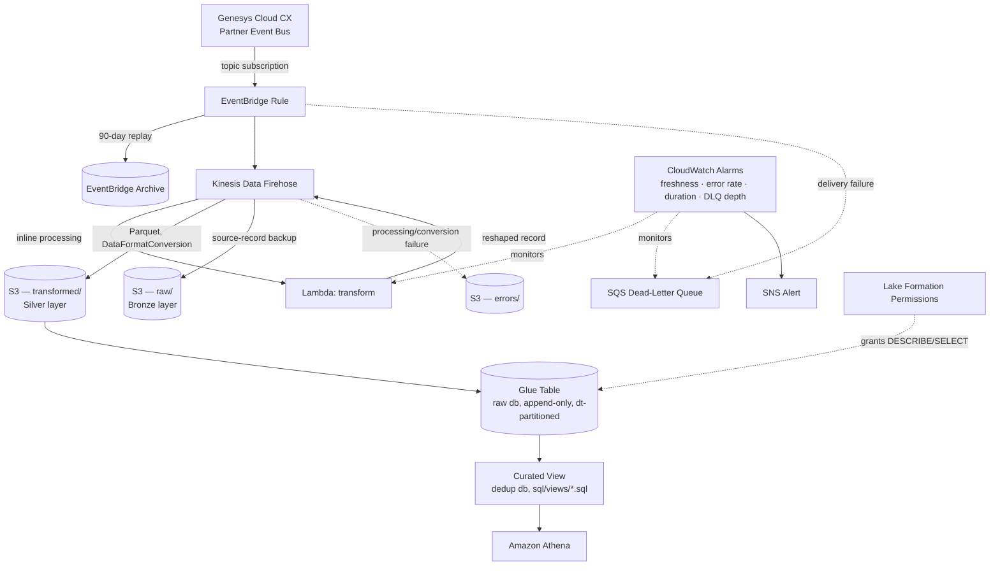
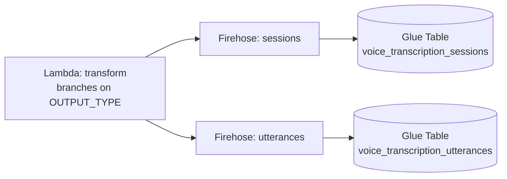

# Event-Driven Pipeline — Shared Pattern

Six of the seven event-driven pipelines (`acd-end`, `attributes`, `customer-end`, `flow-end`, `flow-outcome`, `user-end`) are structurally identical — same resource shape, same failure/retry/monitoring path — differing only in their Genesys event topic, transformation logic, and Glue table schema (see [`docs/data-dictionary.md`](../data-dictionary.md) for the per-pipeline field lists). `transcription` follows the same shape with one addition, shown below — it's still one event domain, but produces two Firehose outputs (sessions and utterances), for 8 real-time Firehose outputs total across the 7 domains. `mappers` is the one CloudFormation stack (the platform's 8th) that doesn't fit this pattern at all — it's a scheduled batch pull, not event-driven — see [`mappers-pattern.md`](mappers-pattern.md).

**Transcription's variant.** One Lambda codebase, one EventBridge rule — but the Lambda branches on an `OUTPUT_TYPE` environment variable to produce two independent outputs from the same incoming event, each with its own Firehose stream, S3 prefix, and Glue table:

## Why this shape

**Append-only, not upsert.** Genesys emits progressive updates per conversation (a transcription session gets a new event per utterance; ACD/flow/user events can be superseded as a call moves through the system). Writing every event to an append-only Glue table and deduplicating at query time (`ROW_NUMBER() OVER (PARTITION BY conversation_id, participant_id ORDER BY recency_ts DESC, event_id DESC)`, see [`sql/views/`](../../sql/views/)) keeps full history available for replay and audit, without upsert complexity in the streaming hot path.

**Two databases, not one.** The raw, append-only Glue tables above live in one Glue database; the deduplicated "latest state" views each pipeline is actually queried through live in a separate curated database (see [`sql/views/README.md`](../../sql/views/README.md)). Keeping them apart means the dedup logic can change — or be recomputed — without touching how data lands, and nothing consuming the curated views needs to know the raw table's partitioning or replay history.

**Three S3 destinations, not one.** Firehose writes transformed Parquet for analytics and a raw JSON source-record backup for replay in parallel, and routes anything it can't process or convert (a Lambda transform error, a Parquet conversion failure) to a dedicated error prefix — so a bad record is diagnosable without reprocessing the whole batch.

**DLQ scope, precisely.** The SQS dead-letter queue attached to each pipeline is the EventBridge Rule's target DLQ — it only captures events EventBridge itself fails to deliver to Firehose (throttling, permissions, endpoint unavailability). It is not a Lambda- or Firehose-processing DLQ: those failures land in the S3 error prefix above instead. CloudWatch alarms watch both surfaces — DLQ depth and Lambda error rate — and page through the same SNS topic when either crosses its threshold.

**EventBridge Archive, not just S3 backup.** Archive is enabled on every rule specifically so a time window can be replayed *through* the pipeline (re-triggering the same Lambda → Firehose → S3 → Glue path) after an incident or a transformation logic change, rather than requiring a manual backfill from Genesys.
