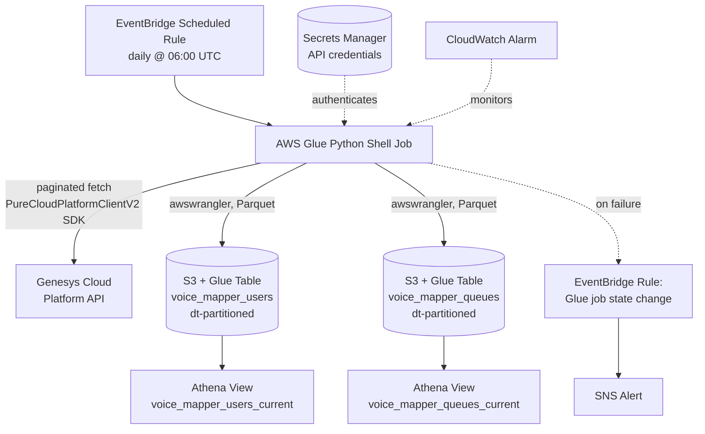

# Mappers Pipeline — Batch Pattern

The Mappers pipeline is the one exception to the platform's event-driven shape: Genesys doesn't publish an EventBridge topic for Users/Queues reference data, so this is a scheduled batch pull against the Genesys Cloud Platform REST API instead — no EventBridge rule, no Firehose, no Lambda transform.

## Why this shape

**Full snapshot, not incremental.** Each run re-fetches the complete Users and Queues lists from the API and writes a new `dt`-partitioned snapshot — there's no delta/incremental pull, since the API doesn't expose a change-since cursor for this data and the volumes are small enough that a daily full refresh is cheap.

**"Current" is a view, not the base table.** The base Glue tables (`voice_mapper_users`, `voice_mapper_queues`) keep every day's snapshot, so historical joins are possible; the `_current` views ([`sql/views/`](../../sql/views/)) filter to `dt = MAX(dt)` for the common case of "who's the queue/agent right now" that the event-driven pipelines' data gets joined against.

**Failure detection is event-driven even though ingestion isn't.** The Glue job's own state-change events (FAILED / TIMEOUT / STOPPED) are captured by an EventBridge rule and routed to the same shared SNS alerting path as the other 7 event-driven pipelines, so a failed daily pull surfaces the same way a stuck DLQ does.
